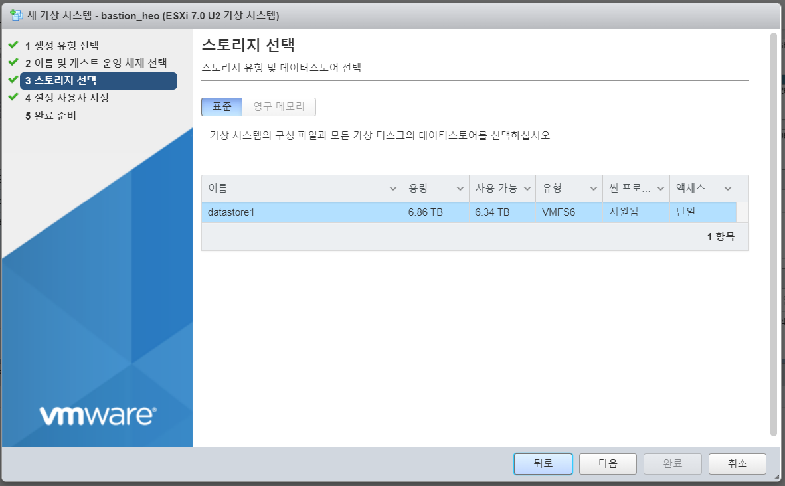

# Overview

완전한 Disconnected 환경은 아니므로 주의, 로컬 레지스트리 구축과 미러링, Quay 구축 등은 존재하나 이미지를 다운로드하는 사전 준비 작업은 인터넷 환경에서 작업

* VMWare ESXi 환경에서 설치
* RHEL 8.5 / RHCOS 4.10 / RHOCP 4.10.16 버전으로 설치 진행
* DNS 주소 : `demo1.ocp4.com`
*   노드 구성은 아래 이미지와 같음

    <figure><figcaption></figcaption></figure>

## 설치 과정

Disconnected 환경에서는 이미지를 다운로드 할 수 없기 때문에 필요한 모든 파일을 이미지화 시켜서 오프라인에서 설치하는 것이 일반적이다.

해당 문서는 완전한 Disconnected 환경에서의 설치가 아니기 때문에 이 점은 참고하여야 한다. (이미지, 패키지 다운로드 등 직접 파일을 외부에서 옮겨하는 것이 아니라 인터넷을 통해 다운로드 받는 것으로 함)

큰 틀에서의 설치 과정은 아래와 같다.

1. 설치 사전준비
   1. ESXi 노드 생성
   2. Yum Repository 생성
2. 레지스트리 미러링 (httpd), 설치 파일 다운로드
3. 네트워크 구성 및 OpenShift-Install
   1. named 설치 및 구성
   2. HAProxy 설치 및 구성
   3. Ignition 파일 생
4. Bootstrap 노드 생성
5. Master 노드 생성
6. Infra, Router, Worker 노드 생성
7. 운영 환경 사전 준비, 웹 콘솔 접
   1. 노드 라벨링, Pod 이동
   2. 사용자 권한 설정
8. Quay 구축
9. OperatorHub 구축

