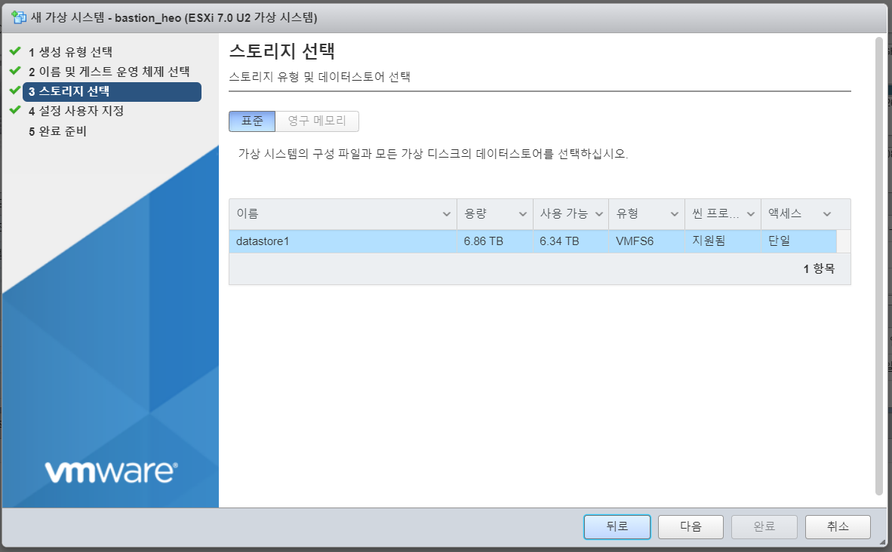

# 🖥 ESXi 노드 생성

## ESXi VM 설정

* 사내 ESXi 계정
  * ID: ----
  * PW: ------------
*   로그인 후 접속 화면

    <figure><figcaption></figcaption></figure>

*   \[VM 생성/등록] 클

    <figure><figcaption></figcaption></figure>

*   이름 및 게스트 운영 체제 선택

    <figure><figcaption></figcaption></figure>

*   스토리지 선택

    <figure><figcaption></figcaption></figure>

*   VM 스펙 설정

    * CPU: 4 Core
    * RAM: 16GB
    * Disk: 120GB
    * Network Adapter: Internal Network
    * 하드디스크: **씬 프로비저닝 됨 체크 (동적할당)**
    * CD/DVD 드라이브 1: 스토리지에 업로드 되어있는 ISO로 부팅할 수 있도록 설정 (Datastore1)

    <figure><figcaption></figcaption></figure>

* VM 실행 후 RHEL 8.5 버전 설치, 네트워크 설정
  * Manual
  * 172.16.0.241/24
  * G/W: 172.16.0.1
  * DNS: 172.16.0.241 / 8.8.8.8\
    (OpenShift 설치 파일 다운 받을 때는 8.8.8.8 사용, 네트워크 구성 후 설치 시에는 172.16.0.241로 설정)
